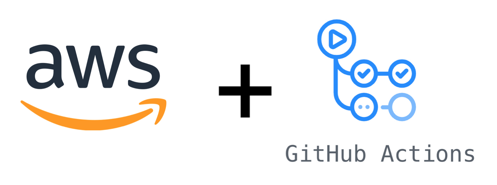

<p align="center">
  
</p>
<h1 style="font-size: 56px; margin: 0; padding: 0;" align="center">
  aws-github-actions
</h1>
<p align="center">
  
</p>

Collection of GitHub actions for interacting with AWS services.

| Action                                                       | Local Action Tests                                                                                                    |
| ------------------------------------------------------------ | --------------------------------------------------------------------------------------------------------------------- |
| [CloudFront Invalidate](../packages/cloudfront_invalidate)   |    |
| [IAM Access Credentials](../packages/iam_access_credentials) |  |
| [S3 Sync](../packages/s3_sync)                               |                                |

## Usage

See individual action directory for details on usage and examples.

- [CloudFront Invalidate](../packages/cloudfront_invalidate) - invalidate AWS CloudFront distribution to force cache refresh
- [IAM Access Credentials](../packages/iam_access_credentials) - ensure GitHub actions workflow environment has necessary AWS IAM credentials available for subsequent AWS actions
- [S3 Sync](../packages/s3_sync) - synchronize local files to remote AWS S3 bucket

## Getting Started

This project is setup as a monorepo using [lerna](https://github.com/lerna/lerna) and [yarn](https://github.com/yarnpkg/yarn) workspaces. If you are unfamiliar with these tools or the practice of a monorepo, I would suggest taking a look at the following articles (I am certain there are many more, but these seemed complete and worthy of a mention):

- [Create a Monorepo with Lerna & Yarn Workspaces](https://medium.com/hy-vee-engineering/creating-a-monorepo-with-lerna-yarn-workspaces-cf163908965d)
- [Why Lerna and Yarn Workspaces is a Perfect Match for Building Mono-Repos – A Close Look at Features and Performance](https://doppelmutzi.github.io/monorepo-lerna-yarn-workspaces/)

The following instructions will help you get setup for development and testing purposes.

### Prerequisites

#### [yarn](https://github.com/yarnpkg/yarn)

`yarn` is used to handle dependencies and executing scripts on the codebase.

See [here](https://yarnpkg.com/en/docs/install#debian-stable) for instructions on installing yarn on your local machine.

#### [lerna](https://github.com/lerna/lerna)

`lerna` is used to managed the project as a monorepo - where each action is packaged and managed individually, and some pacakges are internal modules shared across the actions.

To install lernal locally on your machine, it is recommended to install globally via npm or yarn:

```bash
$ npm install lerna --globally
  -- or --
$ yarn global add lerna
```

Once you have installed both `yarn` and `lerna`, you can install the project dependencies by running the following command from within the project root directory:

```bash
  $ yarn
```

Note: You may come across the comand sequence `lerna bootstrap` in the `lerna` documentation; this is equivalent to running `yarn` where both commands will pull down the necesary dependencies for the project and its packages.

## Contributing

Please read [CONTRIBUTING.md](CONTRIBUTING.md) for details on our code of conduct and the process for submitting pull requests.

## Changelog

Please see the [CHANGELOG.md](CHANGELOG.md) for details on individual releases.
