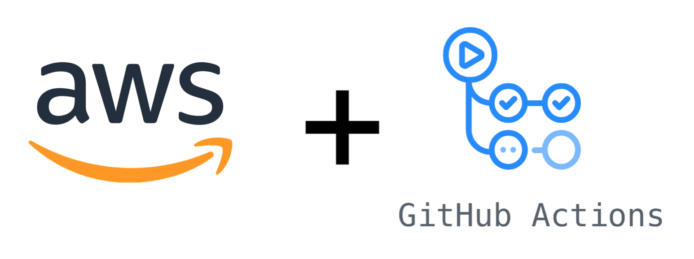

<p align="center">
  
</p>
<h1 style="font-size: 56px; margin: 0; padding: 0;" align="center">
  aws-github-actions
</h1>
<p align="center">
  
</p>

Collection of GitHub actions for interacting with AWS services.

| Action                                                                                    | Local Action Tests                                                                                                      |
| ----------------------------------------------------------------------------------------- | ----------------------------------------------------------------------------------------------------------------------- |
| [`clowdhaus/aws-github-actions/awscli@main`](../awscli)                                 |                |
| [`clowdhaus/aws-github-actions/cloudfront_invalidate@main`](../cloudfront_invalidate)   |      |
| [`clowdhaus/aws-github-actions/iam_access_credentials@main`](../iam_access_credentials) |    |
| [`clowdhaus/aws-github-actions/s3_sync@main`](../s3_sync)                               |                                  |

## Usage

See individual action directory for details on usage and examples.

- [AWS Command Line Interface](../awscli) - execute awscli commands
- [CloudFront Invalidate](../cloudfront_invalidate) - invalidate AWS CloudFront distribution to force cache refresh
- [IAM Access Credentials](../iam_access_credentials) - ensure GitHub actions workflow environment has necessary AWS IAM credentials available for subsequent AWS actions
- [S3 Sync](../s3_sync) - synchronize local files to remote AWS S3 bucket

## Getting Started

This project uses [npm workspaces](https://docs.npmjs.com/cli/using-npm/workspaces) to manage the monorepo. Install dependencies:

```bash
npm install
```

Build all actions:

```bash
npm run all
```

## Contributing

Please read [CODE_OF_CONDUCT.md](CODE_OF_CONDUCT.md) for details on our code of conduct and the process for submitting pull requests.
